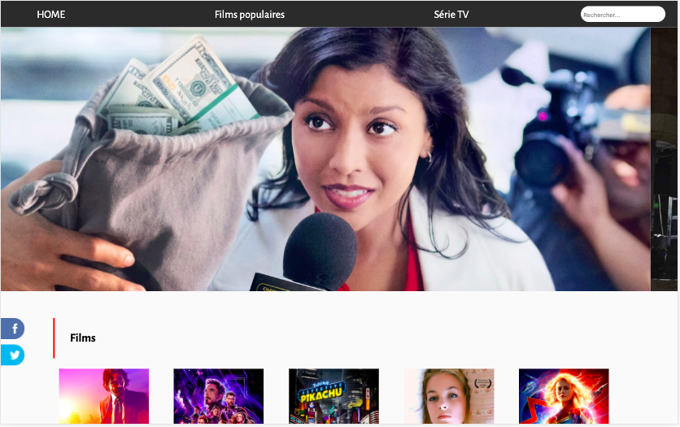
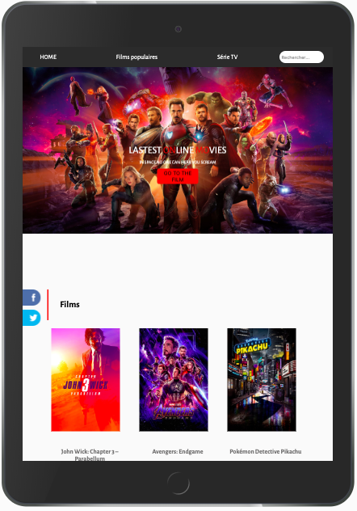
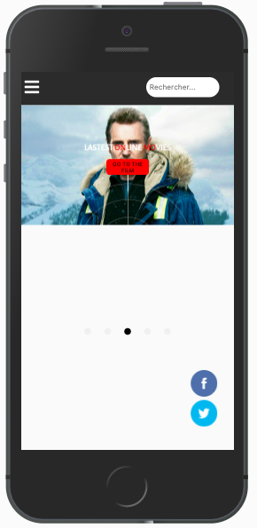

# AllezCiné

This is a new groups project based on the The Movie db’s site. The Movie Database (TMDb) is a community built movie and TV database. Every piece of data has been added by a community dating back to 2008. TMDb's strong international focus and breadth of data is largely unmatched.

*Tags: films, movie, TV, community, popular…*

## Getting Started

The project’s instructions are in a private repo by Becode/Lovelace3.9.
Instructions : 
- On all pages : photo carousel, header and footer
- home page : 20 films and 20 Tv show
- film page : films with infinite scroll
- TV show page : tv shows with infinite scroll

## Visual

## Built With
- Vue.js  The JavaScript framework used
- PHP
- MySQL  database
- Visual Code Studio

## Versioning
We use Github Projects for versioning. For the versions available, see the tags on this repository.

---

## Team

| Emilie Bialais | Jussi Ccoyllo | Pierre-Louis Picard |
| :---: |:---:| :---:|
| []| [] | [] |
| <a href="https://github.com/Ebialais" target="_blank">`github.com/Ebialais`</a> | <a href="https://github.com/JussiCcoyllo" target="_blank">`github.com/JussiCcoyllo`</a> | <a href="https://github.com/Pierre-louis242" target="_blank">`github.com/Pierre-louis242`</a> |

---

## Acknowledgments

Team Becode
